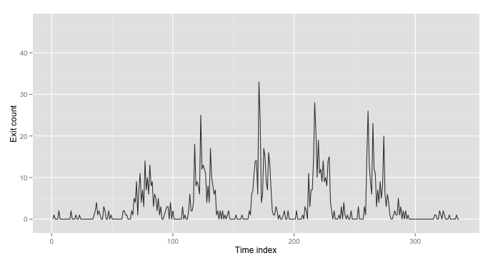
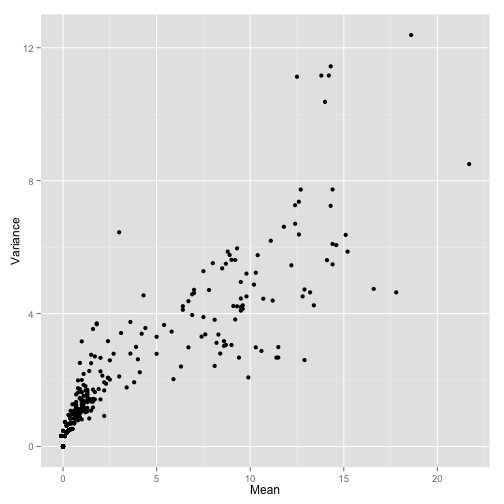
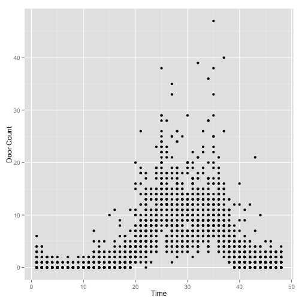
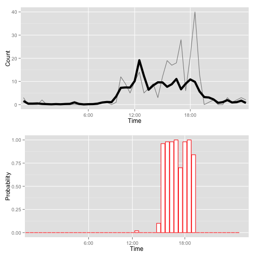

The following tutorial is based on three papers:

* [Learning to Detect Events with Markov-Modulated Poisson Processes](http://citeseerx.ist.psu.edu/viewdoc/summary?doi=10.1.1.87.3348) by A. Ihler, J. Hutchins, and P. Smyth
* [Detecting Network Intrusion Using a Markov Modulated Nonhomogeneous Poisson Process](http://citeseerx.ist.psu.edu/viewdoc/summary?doi=10.1.1.26.8659) by S. Scott
* [The Markov Modulated Poisson Process and Markov Poisson Cascade with Applications to Web Traffic Modeling](http://www.datalab.uci.edu/papers/ScottSmythV7.pdf) by S. Scott and P. Smyth.

This R-implementation is based on the Matlab code provided by J.Hutchins.

The dataset used for this tutorial is available on the UCI Machine Learning Repository [here.](http://archive.ics.uci.edu/ml/datasets/CalIt2+Building+People+Counts)

# When and why should I use a Markov-Modulated Poisson Process?
Time-series of count data occur in many different contexts.  A Markov-modulated Poisson process provides a framework for detecting anomalous events using an unsupervised learning approach and has several advantages compared to typical Poisson models.

The following figure shows three weeks of entry count data recorded every 30 minutes by an optical sensor placed at the main doors of the [Calit2 Institute building](http://www.calit2.uci.edu/calit2-building/default.aspx?cguid=7CE08025-DA82-4BF8-A57B-2F16D8C7592C) on the UC-Irvine campus. These observations are noisy time series with obvious structure which are corrupted by non-periodic events.  Some events, such as the large spike on the second Thursday in the plot below, may be obvious; others may only be noticeable when compared to the average behavior at given time over a long period.

If your data is close to Poisson, the Markov-modulated Poisson process has several advantages over estimating a non-homogenous poisson process and detecting events by finding counts with low probability under the estimated model, $$P(N;\hat{\lambda}(t)) < \epsilon$$

1. The presence of outliers causes bias in the estimated rate of average behavior.
2. Sustained events with slight changes may not be detected with a constant probability threshold.
3. Difficulty in determining the duration of events.

If you believe your data contains events which are relatively rare and interspersed among non-event observations and any event causes a dramatic change in activity, a simple non-homogeneous poisson process model will likely suffice.  Otherwise, the MMPP will likely perform significantly better in terms of detection accuracy.

# Poisson processes
If your data follows a Poisson process, the probability of observing $$N$$ events at any time is given by the following:  

$$P(N;\lambda)=e^{-\lambda}\lambda^N/N!$$

The population mean and variance are both equal to $$\lambda$$.  There are several goodness of fit tests available to test the Poisson distribution assumption.  However, given that the data may be contaminated by bursts of events and the fact that limited observations at each day-time slice may be a problem, a qualitative assessment of the suitability of the Poisson assumption is reasonable and can be obtained by examining the relationship between the mean and variance of observations.

The mean and variance plots indicate that after the removal of observations affected by events, the Poisson assumption seems reasonable.

As motivation for the proposed model, consider the scatterplot of the number of individuals entering the building on any weekday as function of every 30-minute interval.  There is obvious periodic behavior as well as several patches of outliers.  However, in some cases it is not so obvious as to whether observations are due to an external event or just unusual noise.  In order to separate the these scenarios, Ihler et al. defined the model described in the next section.

# Markov-Modulated Poisson Process
The main assumption underlying the Markov-Modulated Poisson Process is that observed count at time t,  $$N(t)$$, is the sum of a baseline Poisson process $$N_0(t)$$ which corresponds to normal activity and a Poisson process corresponding $$N_E(t)$$ to external events.  That is,

$$N(t) = N_0(t) + N_E(t)$$

In order to model the predictable and periodic behavior seen in the above figure, the proposed model for $$N_0(t)$$ is a non-homogenous Poisson process with a particular parametrization of the rate function.

$$\lambda(t) = \lambda_0 \delta_{d(t)} \eta_{d(t),h(t)}$$

$$d(t) \in [1,2,3,4,5,6,7]$$ and $$h(t)$$ indicates the time interval $$t$$, such as every 30 minutes, etc.  The parameters $$\delta$$ and $$\eta$$ must meet the following criteria:

$$\begin{align}
\sum_{i=1}^N \delta_i &= 7\\
\sum_{j=1}^D \eta_{i,j} &= D\\
\end{align}$$

Where D is the number of time intervals in one day (e.g. 24 for one hour intervals, 48 for 30 minute intervals)

# Modeling Rare, Persistent Events
To model the behavior of anomalous periods of time, we use a ternary process $$z(t)$$ to indicate the presence of an event and its type:

$$z(t) =
     \begin{array}{lr}
        0 & \textrm{no event at time t}\\
       +1 & \textrm{positive event at time t}\\
       -1 & \textrm{negative event at time t}\\
     \end{array}$$

$$M_z =
    \left( \begin{array}{ccc}
        z_{00} & z_{0+} & z_{0-}\\
        z_{+0} & z_{++} & z_{+-}\\
        z_{-0} & z_{-+} & z_{--}\\
    \end{array} \right)$$

The transition probability variables priors are specified as

$$z_{00},z_{0+},z_{0-} \sim \textrm{Dir}(z; [a_{00}^Z,a_{0+}^Z,a_{0-}^Z])$$

where Dir is the Dirichlet distribution and the $$a_{0\cdot}^Z$$ are hyperparameters.  Given an event $$z(t)\neq 1$$, the increase or decrease in observation counts, $$N_E(t)$$, is modeled as Poisson with rate $$\gamma (t)$$ where  $$\gamma (t)$$ is assumed to be independently distributed as the Gamma distribution with hyperparameters $$a^E$$ and $$b^E$$.

$$\gamma (t) \sim \Gamma(\gamma;a^E,b^E)$$

Markov modulated Poisson processes may be relatively sensitive to the selection of prior distributions and hence the choice of hyper-parameters.  However, given an idea of what constitutes a “rare” event, how often they occur, and the expected duration of such an event relatively strong priors can avoid over-explanation of the data.

# Estimation of the model
The model is estimated via MCMC by iterating between drawing samples of the hidden variables and sampling the parameters given the complete data.

Sampling the hidden variables given the parameters:

Given $$\lambda (t)$$ and $$M_z$$, the event process $$z(t)$$ can be sampled using a variant of the Forward-Backward algorithm.  Given $$z(t)$$, $$N_0(t)$$ and $$N_e(t)$$ are determined through sampling their posterior distributions.

Sampling the parameters given the complete data:  

Leaving out details, the complete likelihood function for the model given by:

$$\displaystyle \prod_t e^{\lambda(t)}\lambda(t)^{N_0(t)} \prod_t p(Z(t)|Z(t-1)) \prod_{Z(t)=1}NBin(N_E(t))$$

Consider the first term of the likelihood function and by choosing conjugate prior distributions, the posterior distributions of $$\lambda_0$$, $$\delta$$, and $$\eta$$ are the same form with parameters given by sufficient statistics of the data.  The posterior distributions are as follows:

$$\begin{align}
\lambda_0 &\sim \Gamma(\lambda ; a^L + S, b^L +T)\\
\frac{1}{7}[\delta_1, \dots, \delta_7] &\sim Dir(\alpha_1^d+S_1, \dots,\alpha_7^d+S_7 )\\
\frac{1}{D}[\eta_{j,1}, \dots, \eta_{j,D}] &\sim Dir(\alpha_1^h+S_{j,1}, \dots,\alpha_D^h+S_{j,D} )\\
\end{align}$$

where

$$\begin{align}
S_{i,j} &= \sum_{d(t)=j,h(t)=i} N_0(t)\\
S_k &= \sum_i S_{j,i}\\
S &= \sum_j S_j\\
T &= 7DW\\
\end{align}$$

In a similar fashion, the posterior distribution for the transition probabilities are obtained:

$$[z_{00},z_{0+},z_{0-}] \sim Dir(z; a_{00}^Z+Z_{00},a_{0+}^Z+Z_{0=},a_{0-}^Z+Z_{0-})$$

where $$Z_{0+}$$ is the total number of transitions where $$z(t)=0, z(t+1)=+1$$.

# Data format
In order to use the MMPP estimator, your data should be formatted as an R matrix where each column corresponds to one day’s worth of data.  Each row corresponds to one period during the day.

If your data is a delimited text file with a `timestamp` column and an  `event-count` column, you can import it into an R data frame using `read.csv`.  Assuming the name of the resulting data frame is `data` and the columns are named `date` and `count`, the following command will create the matrix:

~~~ r
N<-matrix(data$count, nrow = D, ncol = N)
~~~

Here, `D` is the number of intervals per 24 hours and `N` is the total number of days in your dataset.

## Running The Code

### Inputs
The inputs parameters are as follows:

#### `N`: The count data matrix
Example of seven days worth count data (counts indicate number of building entries per 30 minute interval)

~~~
##       [,1] [,2] [,3] [,4] [,5] [,6] [,7]
##  [1,]    0    1    0    1    0    4    0
##  [2,]    1    0    4    2    0    1    2
##  [3,]    0    0    0    0    2    0    0
##  [4,]    0    0    2    0    0    1    2
##  [5,]    0    0    0    0    0    0    0
##  [6,]    2    0    0    0    0    0    1
##  [7,]    0    0    0    0    0    2    0
##  [8,]    0    0    0    1    0    0    0
##  [9,]    0    0    0    0    0    0    0
## [10,]    0    0    0    0    2    0    0
## [11,]    0    2    0    0    0    0    0
## [12,]    0    2    3    0    0    0    0
## [13,]    0    1    0    1    0    3    0
## [14,]    0    1    1    0    0    0    0
## [15,]    0    0    0    0    1    0    0
## [16,]    2    0    0    0    0    0    0
## [17,]    0    0    2    0    3    0    0
## [18,]    0    2    6    0    2    3    0
## [19,]    0    1    2    2    0    1    0
## [20,]    1    5    2    1   11   15    0
## [21,]    0    4    4    6    3   26    0
## [22,]    0    9   18    7    7   13    0
## [23,]    1    1    8   11    7    9    0
## [24,]    0    7    9   14   14    6    0
## [25,]    0   11    8   14   28   23    0
## [26,]    0    4    6    6   21   12    0
## [27,]    0    7   25   33   10   11    0
## [28,]    0    3   12   24   19    3    1
## [29,]    0   14   13    4   11    7    1
## [30,]    0    7   12    6   12    4    0
## [31,]    0   10   11   17    9    9    0
## [32,]    0    6    4   15   14    5    2
## [33,]    0   13    8    9    9    8    1
## [34,]    0    8    4    7   10   20    0
## [35,]    1    9   17   16    8    6    2
## [36,]    2    3   10   13   14    3    1
## [37,]    4    6    8    7   15    6    0
## [38,]    1    5    6    2    4    4    0
## [39,]    2    2    7    1    2    1    0
## [40,]    1    5    1    1    0    0    1
## [41,]    0    1    2    3    2    0    0
## [42,]    0    3    0    2    0    1    0
## [43,]    3    0    2    0    0    2    0
## [44,]    2    0    0    1    0    1    0
## [45,]    0    1    2    0    1    1    0
## [46,]    0    2    0    0    0    5    1
## [47,]    2    3    1    1    3    1    0
## [48,]    0    3    0    2    0    3    0
~~~

#### `priors`: A list containing each of the specified prior hyperparameters
~~~ r
priors<-list()
priors$aL=1
priors$bL=1 #lambda0, baseline rate
priors$aD=rep(0,1,7)+5 #day effect dirichlet params
priors$aH=matrix(0,nrow=48,ncol=7)+1 #time of day effect dirichlet param
priors$z01=.01*10000
priors$z00=.99*10000   #z(t) event process

priors$z01 = .01*10000; priors$z00 = .99*10000;     # z(t) event process
priors$z10 = .25*10000; priors$z11 = .75*10000;     
priors$aE = 5; priors$bE = 1/3;       # gamma(t), or NBin, for event # process

priors$MODE = 0;
~~~

#### `ITER`: A list containing the number of iterations and the length of the burn-in period

~~~ r
ITER <- c(50, 10)
~~~

#### `events`: Matrix containing the locations of known events (used for verification)
~~~
##       [,1] [,2] [,3] [,4] [,5] [,6] [,7]
##  [1,]    0    0    0    0    0    0    0
##  [2,]    0    0    0    0    0    0    0
##  [3,]    0    0    0    0    0    0    0
##  [4,]    0    0    0    0    0    0    0
##  [5,]    0    0    0    0    0    0    0
##  [6,]    0    0    0    0    0    0    0
##  [7,]    0    0    0    0    0    0    0
##  [8,]    0    0    0    0    0    0    0
##  [9,]    0    0    0    0    0    0    0
## [10,]    0    0    0    0    0    0    0
## [11,]    0    0    0    0    0    0    0
## [12,]    0    0    0    0    0    0    0
## [13,]    0    0    0    0    0    0    0
## [14,]    0    0    0    0    0    0    0
## [15,]    0    0    0    0    0    0    0
## [16,]    0    0    0    0    0    1    0
## [17,]    0    0    0    0    0    1    0
## [18,]    0    0    0    0    0    1    0
## [19,]    0    0    0    0    0    1    0
## [20,]    0    0    0    0    0    1    0
## [21,]    0    0    0    0    0    1    0
## [22,]    0    0    1    0    0    1    0
## [23,]    0    0    1    0    0    0    0
## [24,]    0    0    1    0    0    0    0
## [25,]    0    0    1    0    0    0    0
## [26,]    0    0    1    0    0    0    0
## [27,]    0    0    1    0    0    0    0
## [28,]    0    0    1    0    0    0    0
## [29,]    0    0    0    0    0    0    0
## [30,]    0    0    0    0    0    0    0
## [31,]    0    0    0    0    0    0    0
## [32,]    0    0    0    0    0    0    0
## [33,]    0    0    0    0    0    0    0
## [34,]    0    0    0    0    0    0    0
## [35,]    0    0    0    0    0    0    0
## [36,]    0    0    0    0    0    0    0
## [37,]    0    0    0    0    0    0    0
## [38,]    0    0    0    0    0    0    0
## [39,]    0    0    0    0    0    0    0
## [40,]    0    0    0    0    0    0    0
## [41,]    0    0    0    0    0    0    0
## [42,]    0    0    0    0    0    0    0
## [43,]    0    0    0    0    0    0    0
## [44,]    0    0    0    0    0    0    0
## [45,]    0    0    0    0    0    0    0
## [46,]    0    0    0    0    0    0    0
## [47,]    0    0    0    0    0    0    0
## [48,]    0    0    0    0    0    0    0
~~~

#### `EQUIV`: 2 x 1 vector containing parameter sharing options.
These parameters allow the day of week and time of day effects to be shared by certain days or times.

~~~ r
## EQUIV[1]<-1 All days share total (per day) rate
## EQUIV[1]<-2 Weekend/weekdays share total (per day) rate
## EQUIV[1]<-3 Total (per day) rate unshared

## EQUIV[2]<-1 All days share time profile
## EQUIV[2]<-2 Weekend/weekdays share time profile
## EQUIV[2]<-3 Time profile unshared
~~~

~~~ r
EQUIV <- c(3, 3)
~~~

### Execution
The following code snippet reads the source code and estimates the MMPP model.  Note that the events matrix is not currently used in the code, but is a placeholder for future plotting features.

~~~
source("/your_directory_here/MMPP.R")
samples <- sensorMMPP(N, priors, c(50, 10, 1), events, c(3, 3))
~~~

### Output
The output is a list containing the following multi-dimensional arrays:

Name | Dimensions|Contents
:---:| ---:|:---
$$L$$ | $$D \times T \times N$$|The values of $$\lambda$$ at each day - time slice for every iteration.
$$Z$$ | $$D \times T \times N$$|The $$z=1$$ (event) or $$z=0$$ (no event) at each day - time slice for every iteration.  The average across all iterations gives us the probability of an event at specified day-time slice.
$$M$$ | $$2 \times 2 \times N$$|The estimated transition probabilities for each iteration.
$$N_0$$ | $$D \times T \times N$$|The estimated values of $$N_0(t)$$ for each iteration.
$$N_E$$ | $$D \times T \times N$$|The estimated values of $$N_E(t)$$ for each iteration.
$$logp_NgLM$$ | $$1 \times N$$|The log-likelihood of $$P(N \| L,M)$$ for each iteration.
$$logp_NgLZ$$ | $$1 \times N$$|The log-likelihood of $$P(N \| L,Z)$$ for each iteration.

~~~ r
summary(samples)

##           Length Class  Mode   
## L         168000 -none- numeric
## Z         168000 -none- numeric
## M            200 -none- numeric
## N0        168000 -none- numeric
## NE        168000 -none- numeric
## logp_NgLM     50 -none- numeric
## logp_NgLZ     50 -none- numeric
## logpC          1 -none- numeric
## logpGD         1 -none- numeric
~~~

The following code averages the values of $$Z$$ across all iterations and flattens the matrix into three columns: observation, time of day, day, and probability of event.  The same code is applied to $$L$$ to obtain the average time profile of building entries/exits.

~~~ r
library(reshape)
Z_mean<-apply(samples$Z, c(1, 2), mean)
Z_mean<-melt(Z_mean)
L_mean<-apply(samples$L,c(1,2),mean)
L_mean<-melt(L_mean)
~~~

